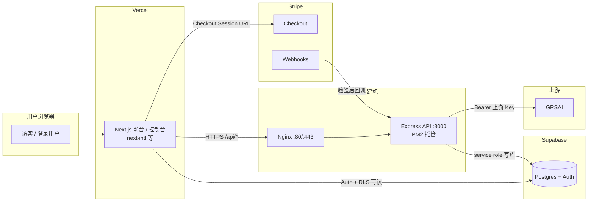

# 部署架构与安全边界

本文档描述当前选型的运行时拓扑：**Vercel（前端）→ DMIT（自建 API 网关）→ Supabase / Stripe / GRSAI**，以及密钥与写库边界。与 `system-spec.md` 中的业务规格互补：此处侧重**谁部署在哪、什么不能暴露给谁**。

---

## 出海版部署与安全边界

Vercel 承载多语言前端页面，包括 Landing、Pricing、登录、控制台和用户交互。前端只允许使用 `NEXT_PUBLIC_*` 环境变量和 Supabase anon key，不允许保存或暴露任何上游密钥、支付密钥或数据库 service role key。

DMIT 承载后端 API、鉴权、计费、token 校验、额度扣减、调用日志、Stripe Webhook 验签和 GRSAI 上游转发。所有敏感密钥，包括 `GRSAI_API_KEY`、`STRIPE_SECRET_KEY`、`STRIPE_WEBHOOK_SECRET`、`SUPABASE_SERVICE_ROLE_KEY`，只能放在 DMIT 后端。

Supabase 作为语言无关的业务账本，存储用户、套餐、订单、平台 token、额度流水和调用日志。充值、扣费、订单状态变更、平台 token 发放等核心写操作必须由 DMIT 后端完成，前端不能直接执行。

Stripe 负责 Checkout 和支付结果通知。系统只以 Stripe Webhook 回调 DMIT 并通过签名验证后的结果为准，不以前端 success 页面作为到账依据。

GRSAI 是上游生成供应商，只允许 DMIT 后端调用。前端请求生成时，必须先进入 DMIT，由 DMIT 校验用户、token、额度和权限后，再转发给 GRSAI。

语言只影响 UI 文案、API 提示和上游生成偏好，不影响订单、额度、token、账本和日志等核心业务字段。所有核心状态字段必须使用语言无关的机器字段，例如 `paid`、`failed`、`active`、`revoked`、`credit_add`、`credit_deduct`。

---

## 配置与密钥分层（纠偏）

**结论**：不是「所有变量都放进数据库」，而是 **业务配置可以放数据库；敏感密钥不能只放数据库**。数据库适合承载可运营参数，**不适合当最高级保险柜**。

### 一句话原则

- **Vercel**：只放**公开连接参数**（`NEXT_PUBLIC_*`、anon key 等）。
- **DMIT**：只放**真正的秘密**（service role、Stripe secret、Webhook secret、上游 Key、`TOKEN_PEPPER` 等）。
- **Supabase**：放**业务配置与账本数据**（套餐、上游开关、模型列表、功能开关、订单、账本、日志元数据等）。
- **不要把数据库当 Secret Manager**；库被打穿、备份导出、后台 SQL 时的暴露面都会放大。

### 第一层：系统密钥层（仅 DMIT 环境）

仅存 DMIT 服务器上的 `.env`、PM2/systemd 注入或等价机密托管，**不进**前端构建、**不以明文**塞进可被多人查询的业务表：

| 示例变量 | 说明 |
| -------- | ---- |
| `SUPABASE_URL` | 项目 URL（可与前端同源公开 URL；密钥仍只在 DMIT） |
| `SUPABASE_SERVICE_ROLE_KEY` | 仅 DMIT |
| `STRIPE_SECRET_KEY` | 仅 DMIT |
| `STRIPE_WEBHOOK_SECRET` | 仅 DMIT |
| `GRSAI_API_KEY`（及备用上游 Key） | 仅 DMIT |
| `TOKEN_PEPPER` / `TOKEN_HASH_PEPPER` | 仅 DMIT |
| `JWT` / 签名用服务端密钥（若有） | 仅 DMIT |

### 第二层：业务配置层（Supabase / Postgres）

**适合入库**的可运营、可管理参数（非「系统总钥匙」）：

- 套餐与展示：`plans`（含 `stripe_price_id`、`credit_amount`、`active` 等）
- 上游路由：`upstreams`、`upstream_models`（名称、启用、优先级、`base_url`、模型开放策略等）；**上游调用密钥若落库须应用层加密与轮换，禁止明文当作后台可随意导出的配置**
- 未来可扩展：`system_settings`、`feature_flags`、公告、默认语言/币种、站点级文案键等
- 业务运行数据：`profiles` / `orders` / `api_tokens`（仅存 hash）/ `credit_ledger` / `usage_logs` 等

### 禁止（或禁止明文）放进「普通业务表」供运营随手编辑的

- `SUPABASE_SERVICE_ROLE_KEY`、`STRIPE_SECRET_KEY`、`STRIPE_WEBHOOK_SECRET`
- `GRSAI_API_KEY`、上游真实私钥
- 平台 token **明文**、`TOKEN_PEPPER`、JWT 签名私钥、SSH 私钥、任意超级管理员凭证

原因简述：**一旦 DB 泄露或被备份带走，不希望连同「系统总钥匙」一起失守**；后台页面与导出越多，库内明文 secret 越危险。

### 常见误区

1. 把「配置」与「秘密」混在同一套后台可编辑项里，图省事把所有 key 都做成表字段。
2. 以为「密钥在库里就比在 env 里安全」——实则暴露面常被放大。
3. 备份、迁移、排障导出把明文 secret 一并带走。

---

## 端到端请求链路（定型）

```text
用户浏览器 → Vercel 前端 → DMIT API（Node.js / Express，经 Nginx 反代）→ Supabase（读写由后端 service role 主导）
                                                                    → Stripe Webhook（验签后写订单/额度）
                                                                    → GRSAI（仅后端持有 Key）
```

前端环境变量示例：`NEXT_PUBLIC_API_BASE_URL` 指向 DMIT 对外 API 基址（仅 URL，无密钥）。

---

## 架构图（Mermaid）



---

## 与仓库其他文档的关系

| 文档 | 侧重 |
| ---- | ---- |
| `docs/system-spec.md` | V1 范围冻结、数据模型、状态机、API 形态 |
| `docs/architecture.md`（本文） | 部署拓扑、密钥边界、**配置 vs 密钥双层模型**、组件职责 |
| `docs/supabase-schema-*.sql` | 具体 DDL（若有） |
| `docs/dmit-api-minimal-supabase.md` | DMIT 接 Supabase 最小步骤；实现 `apps/dmit-api/` |

若 Monorepo 中仍出现历史草案（如 FastAPI gateway），以**实际落在 DMIT 的 Node/Express 网关**为准，文档-only 名称差异不影响边界原则。
