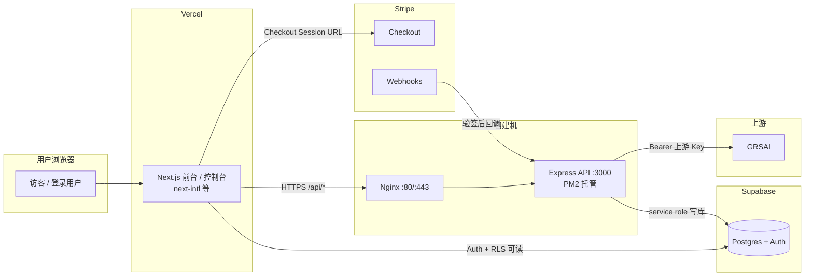

# Tokfai 平台手册（全量合并版）

> **说明**：由仓库内多份 `docs` 与 SQL 合并而成，便于导出、打印或发给合作方。**日常维护以分文件为准**（`architecture.md`、`system-spec.md` 等）；本手册需时可重新生成。

## 目录

- [1. 概览与基础设施](#1-概览与基础设施)
- [2. 部署架构与安全边界（全文）](#2-部署架构与安全边界全文)
- [3. 系统规格 system-spec（全文）](#3-系统规格-system-spec全文)
- [4. V1 角色权限矩阵（全文）](#4-v1-角色权限矩阵全文)
- [5. Supabase RLS 策略初稿（全文）](#5-supabase-rls-策略初稿全文)
- [6. Supabase Schema V1 SQL（全文）](#6-supabase-schema-v1-sql全文)
- [7. Supabase 上游表 SQL（全文）](#7-supabase-上游表-sql全文)
- [8. DMIT 第一批：接 Supabase](#8-dmit-第一批接-supabase)
- [9. DMIT 第二批：me / tokens / checkout](#9-dmit-第二批me--tokens--checkout)
- [10. DMIT 第三批：Gateway / usage_logs](#10-dmit-第三批gateway--usage_logs)

---

## 1. 概览与基础设施

### 生产域名（tokfai）

| 主机名 | 用途 |
| ------ | ---- |
| `https://tokfai.com` | 官网（Landing / 控制台） |
| `https://www.tokfai.com` | 同上（建议 301 归一） |
| `https://api.tokfai.com` | DMIT 后端 API（`/health`、`/api/*`、`/v1/*`、Webhook） |

前端：`NEXT_PUBLIC_API_BASE_URL=https://api.tokfai.com`（**无密钥**）。**DNS**：Cloudflare A 记录 `@`、`www`、`api` 均指向 DMIT 公网 IP（当前部署为 `154.12.189.107`），可开橙色代理。

### 仓库与代码

- 前端：`apps/web`（Next.js / Vercel）
- 后端：`apps/dmit-api`（Express / DMIT `api.tokfai.com`）
- 数据库：Supabase（Postgres + Auth）
- 本手册源文件均位于 `docs/` 目录。

---

## 2. 部署架构与安全边界（全文）

_以下为 `docs/architecture.md` 原文。_


本文档描述当前选型的运行时拓扑：**Vercel（前端）→ DMIT（自建 API 网关）→ Supabase / Stripe / GRSAI**，以及密钥与写库边界。与 `system-spec.md` 中的业务规格互补：此处侧重**谁部署在哪、什么不能暴露给谁**。

---

## 生产域名（tokfai）

| 主机名 | 用途 |
| ------ | ---- |
| `https://tokfai.com` | 官网（Landing / 控制台等前端） |
| `https://www.tokfai.com` | 同上（建议 301 归一到主域或反代同一套前端） |
| `https://api.tokfai.com` | DMIT 后端 API（`/health`、`/api/*`、`/v1/*`、Webhook 等） |

前端环境变量示例：`NEXT_PUBLIC_API_BASE_URL=https://api.tokfai.com`（仅公网基址，无密钥）。  
DMIT 上 Nginx / 证书为 **`api.tokfai.com`** 签发；Stripe Webhook、上游回调 URL 亦指向该 API 主机。

---

## 出海版部署与安全边界

Vercel 承载多语言前端页面，包括 Landing、Pricing、登录、控制台和用户交互。前端只允许使用 `NEXT_PUBLIC_*` 环境变量和 Supabase anon key，不允许保存或暴露任何上游密钥、支付密钥或数据库 service role key。

DMIT 承载后端 API、鉴权、计费、token 校验、额度扣减、调用日志、Stripe Webhook 验签和 GRSAI 上游转发。所有敏感密钥，包括 `GRSAI_API_KEY`、`STRIPE_SECRET_KEY`、`STRIPE_WEBHOOK_SECRET`、`SUPABASE_SERVICE_ROLE_KEY`，只能放在 DMIT 后端。

Supabase 作为语言无关的业务账本，存储用户、套餐、订单、平台 token、额度流水和调用日志。充值、扣费、订单状态变更、平台 token 发放等核心写操作必须由 DMIT 后端完成，前端不能直接执行。

Stripe 负责 Checkout 和支付结果通知。系统只以 Stripe Webhook 回调 DMIT 并通过签名验证后的结果为准，不以前端 success 页面作为到账依据。

GRSAI 是上游生成供应商，只允许 DMIT 后端调用。前端请求生成时，必须先进入 DMIT，由 DMIT 校验用户、token、额度和权限后，再转发给 GRSAI。

语言只影响 UI 文案、API 提示和上游生成偏好，不影响订单、额度、token、账本和日志等核心业务字段。所有核心状态字段必须使用语言无关的机器字段，例如 `paid`、`failed`、`active`、`revoked`、`credit_add`、`credit_deduct`。

---

## 配置与密钥分层（纠偏）

**结论**：不是「所有变量都放进数据库」，而是 **业务配置可以放数据库；敏感密钥不能只放数据库**。数据库适合承载可运营参数，**不适合当最高级保险柜**。

### 一句话原则

- **Vercel**：只放**公开连接参数**（`NEXT_PUBLIC_*`、anon key 等）。
- **DMIT**：只放**真正的秘密**（service role、Stripe secret、Webhook secret、上游 Key、`TOKEN_PEPPER` 等）。
- **Supabase**：放**业务配置与账本数据**（套餐、上游开关、模型列表、功能开关、订单、账本、日志元数据等）。
- **不要把数据库当 Secret Manager**；库被打穿、备份导出、后台 SQL 时的暴露面都会放大。

### 第一层：系统密钥层（仅 DMIT 环境）

仅存 DMIT 服务器上的 `.env`、PM2/systemd 注入或等价机密托管，**不进**前端构建、**不以明文**塞进可被多人查询的业务表：

| 示例变量 | 说明 |
| -------- | ---- |
| `SUPABASE_URL` | 项目 URL（可与前端同源公开 URL；密钥仍只在 DMIT） |
| `SUPABASE_SERVICE_ROLE_KEY` | 仅 DMIT |
| `STRIPE_SECRET_KEY` | 仅 DMIT |
| `STRIPE_WEBHOOK_SECRET` | 仅 DMIT |
| `GRSAI_API_KEY`（及备用上游 Key） | 仅 DMIT |
| `TOKEN_PEPPER` / `TOKEN_HASH_PEPPER` | 仅 DMIT |
| `JWT` / 签名用服务端密钥（若有） | 仅 DMIT |

### 第二层：业务配置层（Supabase / Postgres）

**适合入库**的可运营、可管理参数（非「系统总钥匙」）：

- 套餐与展示：`plans`（含 `stripe_price_id`、`credit_amount`、`active` 等）
- 上游路由：`upstreams`、`upstream_models`（名称、启用、优先级、`base_url`、模型开放策略等）；**上游调用密钥若落库须应用层加密与轮换，禁止明文当作后台可随意导出的配置**
- 未来可扩展：`system_settings`、`feature_flags`、公告、默认语言/币种、站点级文案键等
- 业务运行数据：`profiles` / `orders` / `api_tokens`（仅存 hash）/ `credit_ledger` / `usage_logs` 等

### 禁止（或禁止明文）放进「普通业务表」供运营随手编辑的

- `SUPABASE_SERVICE_ROLE_KEY`、`STRIPE_SECRET_KEY`、`STRIPE_WEBHOOK_SECRET`
- `GRSAI_API_KEY`、上游真实私钥
- 平台 token **明文**、`TOKEN_PEPPER`、JWT 签名私钥、SSH 私钥、任意超级管理员凭证

原因简述：**一旦 DB 泄露或被备份带走，不希望连同「系统总钥匙」一起失守**；后台页面与导出越多，库内明文 secret 越危险。

### 常见误区

1. 把「配置」与「秘密」混在同一套后台可编辑项里，图省事把所有 key 都做成表字段。
2. 以为「密钥在库里就比在 env 里安全」——实则暴露面常被放大。
3. 备份、迁移、排障导出把明文 secret 一并带走。

---

## 端到端请求链路（定型）

```text
用户浏览器 → Vercel 前端 → DMIT API（Node.js / Express，经 Nginx 反代）→ Supabase（读写由后端 service role 主导）
                                                                    → Stripe Webhook（验签后写订单/额度）
                                                                    → GRSAI（仅后端持有 Key）
```

前端环境变量示例：`NEXT_PUBLIC_API_BASE_URL` 指向 DMIT 对外 API 基址（仅 URL，无密钥）。

---

## 架构图（Mermaid）



---

## 与仓库其他文档的关系

| 文档 | 侧重 |
| ---- | ---- |
| `docs/system-spec.md` | V1 范围冻结、数据模型、状态机、API 形态 |
| `docs/architecture.md`（本文） | 部署拓扑、密钥边界、**配置 vs 密钥双层模型**、组件职责 |
| `docs/supabase-schema-*.sql` | 具体 DDL（若有） |
| `docs/dmit-api-minimal-supabase.md` | DMIT 接 Supabase 最小步骤；实现 `apps/dmit-api/` |
| `docs/dmit-api-batch-two-me-tokens-checkout.md` | `/api/me`、`/api/tokens`、`/api/checkout`（Bearer Supabase JWT） |
| `docs/dmit-api-batch-three-gateway.md` | `/v1/models`、`/v1/chat/completions`（Bearer 平台 token）+ `usage_logs` |
| `docs/tokfai-platform-handbook.md` | **全量合并手册**（架构 + 规格 + 权限 + RLS + SQL + DMIT 三批；单文件导出） |

若 Monorepo 中仍出现历史草案（如 FastAPI gateway），以**实际落在 DMIT 的 Node/Express 网关**为准，文档-only 名称差异不影响边界原则。

---

## 3. 系统规格 system-spec（全文）

_以下为 `docs/system-spec.md` 原文。_


> 本文档是**系统级规格说明**，用于：排期、拆任务、对齐实现边界、约束 V1 范围，避免跑偏。
>
> 原则：参考 New API 的产品链路与结构，但核心实现**完全自控**（用户/支付/token/网关/日志）。

---

## 0. V1 冻结范围（必须遵守）

> 这部分用于**冻结 V1 scope**。任何“文档里有写”但不在下列清单内的内容，均不得进入 V1 Sprint。

### 0.1 V1 仅开发（允许进入任务板）

- **用户与状态**
  - Supabase Auth
  - `profiles`（`status`/`role`/`plan` 最小字段；出海版可预留 `locale`/`currency` 等，见 §3.1、§8）
- **前台与控制台**
  - Landing / Pricing / Contact / Docs（最小可演示）
  - Dashboard（Models / Tokens / Usage 最小页）
- **支付最小闭环**
  - Stripe Checkout（或同级最小收款链路）
  - success / cancel 页面
  - `paid_pending` → admin 人工开通为 `active`
- **Token 系统**
  - `api_tokens` 表（冻结 DDL 表名）
  - 创建/禁用/删除 token（明文只显示一次）
- **Gateway 主链**
  - `GET /v1/models`
  - `POST /v1/chat/completions`
  - token 校验 + 用户状态校验 + 模型白名单校验 + 上游转发
- **账本与订单**
  - `plans`、`orders`、`credit_ledger`
- **Usage + Audit + 留资**
  - `usage_logs`
  - `leads`（留资；写入走服务端）
  - `admin_audit_logs`
  - admin 查日志 + 敏感操作留痕

### 0.2 V1 不开发（禁止进入任务板）

- affiliates / referrals / commissions / payouts（任何分销与结算体系）
- affiliate dashboard
- `support` 子角色与细粒度 RBAC（仅预留，不实现）
- 复杂计费（TPM/RPM/缓存计费/多倍率叠加/账单）
- 复杂风控（黑白名单、设备指纹、行为反作弊）
- 白标体系
- 多租户组织权限
- 大而全数据看板（仅提供最小日志查询）

## 1. 目标与非目标

### 1.1 目标（V1 必须达成）

V1 主链必须跑通：

```text
用户登录
→ 看到套餐/状态
→ 发放平台 token
→ token 调你自己的网关
→ 你自己的网关转发上游
→ 返回模型结果
→ 写最小日志
```

V1 需要具备：

- **可销售演示**：前台 + 控制台基本页面可用
- **可交付**：用户能拿到 token 并调用网关得到真实返回
- **可追责**：每次调用可定位到 token / 用户 / 模型 / 上游 / 结果
- **可控**：token 可禁用、模型可控、用户状态可控

### 1.2 非目标（V1 刻意不做）

以下全部后移（避免平台化泥潭）：

- 分销体系全自动化（返佣、结算、对账、税务、提现）
- 复杂计费（TPM/RPM/缓存计费/多倍率叠加/账单系统）
- 复杂风控（黑白名单、指纹、IP 风险、行为分析）
- 多租户组织权限（企业 RBAC、组织/项目层级）
- 白标（域名/主题/品牌全套）
- 大而全监控面板（先日志可查即可）

---

## 2. 系统边界与组件

### 2.1 组件划分（Monorepo）

```text
apps/web       # 前台 + 控制台（Next.js）
apps/gateway   # 网关（FastAPI，OpenAI-compatible）
packages/shared# 共享类型/常量（可选）
docs/          # 规格与运行文档
```

### 2.2 关键外部依赖（可替换）

- **Auth/DB**：Supabase（Postgres + Auth）
- **Payment**：Stripe（V1 最小接入）
- **Upstream**：朋友上游 / 自建上游（V1 先接现成上游）
- **Analytics（可选）**：GA4 / Umami（Web 侧）
- **Profiling（可选）**：pprof 风格 / Pyroscope（Gateway 侧）

### 2.3 出海版部署拓扑（正式边界）

> 与「单纯把中文页面翻译成英文」不同：**出海版**要求从第一天起按多语言、多币种、多地区合规、上游语言参数可控来设计；**账本与状态机仍全部语言无关**。

```text
Vercel        = 国际化前台 / 控制台 / 定价页
DMIT（或等同自建机）= 国际化 API 网关 / 鉴权 / 计费 / 上游路由（本文档中的 apps/gateway 部署目标）
Supabase      = 语言无关的业务账本
Stripe        = 多币种收款与 Webhook 回调
GRSAI（或上游）= 模型/图片供应商，仅由网关侧调用；语言参数由网关解析后下发
```

核心一句：

```text
语言只影响展示、提示、上游生成偏好；
计费、订单、额度、token、日志，必须全部语言无关。
```

密钥存放、写库边界与端到端请求链路的完整说明见 [`architecture.md`](./architecture.md)。

---

## 3. 核心数据模型（V1 最小）

> 建议都放在 Supabase（Postgres），便于 RLS 与审计。
>
> **冻结 DDL**：[`docs/supabase-schema-v1.sql`](./supabase-schema-v1.sql)（8 张表；平台密钥表名为 `api_tokens`；含 RLS、`is_admin()`、套餐种子；页面与文档仍可称 “tokens”。）  
> **RLS 叙事与验证**：[`docs/supabase-rls-v1.md`](./supabase-rls-v1.md)；权限矩阵：[`docs/role-permissions-matrix-v1.md`](./role-permissions-matrix-v1.md）。

### 3.1 `profiles`

- `id uuid pk`（= auth.users.id）
- `email text`
- `role text`（V1：`user`/`admin`）
- `plan text`（V1：默认 `free`；字符串套餐码）
- `status text`（`visitor`/`pending`/`paid_pending`/`active`/`suspended`）
- `company text null`
- `telegram text null`
- **出海版建议字段（V1 可一并预留，避免日后迁表）**
  - `locale text default 'en'`（BCP 47，如 `en`、`zh-CN`）
  - `country text null`
  - `timezone text null`
  - `currency text default 'USD'`（冻结 DDL 与 Stripe 字段对齐；应用层可比对小写）
- `created_at timestamptz`
- `updated_at timestamptz`

### 3.2 `api_tokens`

核心原则：**只存 hash，不存明文**。

- `id uuid pk`
- `user_id uuid fk -> profiles.id`
- `name text`
- `token_hash text unique`（如 `sha256(plain + pepper)`）
- `status text`（`active`/`disabled`/`deleted`）
- `allowed_models jsonb null`（`null` 表示全允许；或数组白名单）
- `created_at timestamptz`
- `last_used_at timestamptz null`
- `updated_at timestamptz`（DDL 含自动更新触发器）

### 3.3 `usage_logs`

V1 只记最小字段，先保证责任链清晰：

- `id bigserial pk`
- `token_id uuid null`
- `user_id uuid null`
- `model text`
- `upstream_name text`
- `status text`（`ok`/`error`/`denied`）
- `http_status int null`
- `latency_ms int null`
- `request_id text null`（可选：用于串联网关日志）
- `error_code text null`
- `error_message text null`
- **出海版建议字段（可选；便于定位语言与上游）**
  - `locale text null`（请求解析后的 locale，**不参与扣费逻辑**）
  - `upstream_provider text default 'grsai'`（或实际上游名）
  - `upstream_model text null`（可与 `model` 对齐，按需冗余）
  - `request_language text null`（传给上游的语言/偏好摘要）
- `credits_charged bigint null`、`credit_ledger_id fk null`（可选：与账本行对齐）
- `created_at timestamptz`

### 3.4 `leads`（留资）

- `id bigserial pk`
- `email text`
- `name text null`
- `company text null`
- `telegram text null`
- `message text null`
- `source text`
- `created_at timestamptz`

### 3.5 `orders`（Stripe Checkout / Webhook）

**字段值一律机器可读**；到账只认 Webhook 写库。

- `id bigserial pk`
- `user_id uuid fk -> profiles`
- `plan_code text not null`（与 `plans.code` 对齐）
- `provider text`（如 `stripe`）
- `stripe_checkout_session_id text unique null`
- `stripe_payment_intent_id text null`
- `currency text not null default 'USD'`
- `amount_total int not null`（最小货币单位）
- `status text not null`：`created` / `paid` / `failed` / `refunded` / `canceled`
- `paid_at timestamptz null`
- `metadata jsonb`
- `created_at` / `updated_at timestamptz`

### 3.6 `plans`（套餐 / 定价）

- `id bigserial pk`
- `code text unique`（如 `starter` / `pro` / `channel`）
- `name text`、`description text`
- `currency text not null default 'USD'`
- `price_amount int not null`（最小货币单位）
- `credit_amount bigint not null default 0`（购买/开通附带额度）
- `stripe_price_id text null`
- `active boolean`、`sort_order int`
- `metadata jsonb`
- `created_at` / `updated_at timestamptz`

### 3.7 `credit_ledger`（额度唯一账本）

- `id bigserial pk`
- `user_id uuid fk`
- `order_id fk null`、`token_id fk null`（追溯来源）
- `kind text`：`credit_add` / `credit_deduct` / `credit_refund` / `credit_adjust`
- `amount bigint not null`（符号由 `kind` + 业务规则约束）
- `balance_after bigint null`（可选快照）
- `reason text null`、`metadata jsonb`
- `created_at timestamptz`

### 3.8 `admin_audit_logs`（管理员敏感操作）

- `id bigserial pk`
- `admin_user_id uuid fk null`
- `action text`、`target_type text`、`target_id text`
- `before jsonb`、`after jsonb null`
- `ip text`、`user_agent text null`
- `created_at timestamptz`

---

## 4. 权限与状态机

### 4.1 用户状态（`profiles.status`）

推荐状态流：

```text
visitor
→ pending（注册/登录后默认）
→ paid_pending（已付款待人工开通）
→ active（可发 token / 可调用）
→ suspended（封禁/欠费/风控）
```

### 4.2 Token 状态（`api_tokens.status`）

```text
active   # 正常可用
disabled # 禁用（拒绝调用）
deleted  # 软删除（拒绝调用，列表默认不展示）
```

### 4.3 V1 鉴权判定顺序（网关）

收到请求（Bearer token）：

1. token 是否存在（hash 命中）
2. token 是否 `active`
3. token 归属用户是否 `profiles.status == active`
4. 目标模型是否在 `allowed_models` 白名单（或白名单为空/为 null 表示全允许）

失败时必须：

- 返回清晰的 401/403
- 写入 `usage_logs`（status=denied，含 reason）

---

## 5. 对外接口（V1）

### 5.1 Web（控制台）

V1 必需页面：

- Landing / Pricing / Contact
- Login / Dashboard
- Dashboard / Models（模型展示）
- Dashboard / Tokens（token 列表/新建/禁用）
- Dashboard / Usage（最小日志列表，后续再做图表）

### 5.2 Web API（Next.js Route Handlers）

V1 推荐最小接口：

- `POST /api/leads`
- `POST /api/tokens`（服务端创建 token，返回一次性明文）
- `GET /api/tokens`
- `PATCH /api/tokens/:id`（enable/disable）
- `DELETE /api/tokens/:id`（软删）

> 注意：凡涉及 DB 写与 token 生成的接口，必须在服务端使用 `SUPABASE_SERVICE_ROLE_KEY`，**绝不下发前端**。

### 5.3 Gateway API（OpenAI-compatible）

V1 必需：

- `GET /v1/models`
- `POST /v1/chat/completions`

V1 可选：

- `GET /healthz`
- `GET /debug/pprof/`（启用开关时）

---

## 6. 可观测性与审计（V1）

### 6.1 Web 分析（可选）

- GA4 / Umami：仅通过环境变量注入（见 `docs/analytics.md`）

### 6.2 Gateway 性能分析（可选）

- pprof 风格端点 / Pyroscope（见 `docs/performance-profiling.md`）

### 6.3 审计底线

- token 明文不落库
- 所有模型调用必须过 gateway（避免绕过审计）
- 失败/拒绝也必须写 `usage_logs`

---

## 7. 部署与环境（V1）

### 7.1 Web

- Next.js（Vercel 或自建）
- 环境变量：见根目录 `.env.example`

### 7.2 Gateway

- FastAPI + Uvicorn（容器化/裸机均可）
- 先支持单实例；水平扩展时通过 `HOSTNAME` tag 区分实例（Pyroscope）

---

## 8. 出海版（国际化 / 多币种 / 合规边界）

### 8.1 状态与账本字段（禁止自然语言）

数据库与 API **只用机器字段**，例如：

```text
created / paid / failed / refunded / canceled   # orders.status
active / revoked / expired                       # token 等（示例）
credit_add / credit_deduct / credit_refund / credit_adjust   # credit_ledger.kind
```

前端按用户 `locale` 翻译展示；**禁止**将「已支付」等中文或英文句子写入状态字段。

### 8.2 语言来源优先级（V1 建议）

| 优先级 | 来源 | 用途 |
| --- | --- | --- |
| 1 | 用户手动切换语言 | 最优先 |
| 2 | 登录用户 `profiles.locale` | 持久化偏好 |
| 3 | Cookie / localStorage | 未登录访客 |
| 4 | 浏览器 `Accept-Language` | 首次访问兜底 |
| 5 | 默认 `en` | 出海默认主语言 |

中文使用 `zh-CN`（与 BCP 47 一致）。

### 8.3 前端（Vercel / Next.js）

- 推荐 **`next-intl`**（或等价方案），路由采用 **`/en`、`/zh`** 前缀（利于 SEO 与投放），例如 `/en/pricing`、`/zh/pricing`。
- 前端职责限于：多语言 UI、登录注册界面、套餐展示、调用网关暴露的 HTTP API、跳转 Stripe Checkout、展示额度与结果。
- 前端**不得**：扣费、发放平台 token、改订单、直连上游、持有 `service_role` / Stripe secret / 上游 API Key。

### 8.4 网关（DMIT）与 `Accept-Language`

前端请求网关时建议携带：

```http
Accept-Language: en
```

或

```http
Accept-Language: zh-CN
```

网关解析为固定集合（如 `en`、`zh-CN`），用于：

1. 返回**可选**的多语言错误提示（错误码仍稳定、语言无关）。
2. 调用上游（如 GRSAI）时注入 `language` / locale / system 提示，控制生成语言偏好。
3. **写 `usage_logs` 时记录 `locale` / `request_language`**，但不以此参与扣费或账本分支。

密钥与上游调用仍仅在网关侧。

### 8.5 Stripe（出海 V1 建议）

| 主题 | V1 建议 |
| --- | --- |
| 币种 | 先 **USD**；表结构预留 `currency`，后续加 CNY/HKD 等 |
| 成功判定 | **仅认** Webhook 验签后写库；不认前端 success 页 |
| 套餐 | `plans.stripe_price_id` 与 Stripe Price 对齐 |
| 税务 / 合规 | V1 可简化产品逻辑，但对外 **Terms / Privacy** 建议中英文常备 |

### 8.6 上游语言映射（示例）

网关根据 locale 包装上游请求（示例思路，非强制字面文案）：

- `zh-CN`：system 侧提示「除非用户明确要求其他语言，否则用中文回复」等。
- `en`：同理使用英文。

图片类可把「User locale: …」写入网关侧 prompt 包装层，**上游 API Key 仅在网关**。

### 8.7 部署与安全边界（文档照）

#### Deployment & security boundary (global version)

- Vercel hosts the multilingual frontend.
- The API gateway (DMIT or equivalent) hosts the backend API, billing boundary, token verification, credit deduction, and upstream proxy.
- Supabase stores language-neutral business records.
- Stripe handles checkout and sends signed webhooks to the gateway.
- GRSAI (or the configured upstream) is the generation provider and is only called by the gateway.
- The frontend never stores or exposes upstream keys, Stripe secret keys, or Supabase service role keys.
- Locale affects UI copy, optional API messages, and upstream generation preference only. Billing, orders, credits, tokens, and logs use language-neutral machine fields.

#### 出海版部署与安全边界（中文）

- Vercel 承载多语言前端。
- DMIT（或等同部署上的网关）承载后端 API、计费边界、token 校验、额度扣减、上游转发。
- Supabase 存储语言无关的业务账本。
- Stripe 负责 Checkout，并通过签名 Webhook 回调网关。
- GRSAI（或上游）是生成供应商，只允许网关调用。
- 前端不得保存或暴露上游 Key、Stripe Secret Key、Supabase Service Role Key。
- 语言只影响 UI 文案、可选 API 提示与上游生成偏好；订单、额度、token、账本与日志等核心业务字段保持语言无关的机器取值。

### 8.8 建议实施顺序（出海版 / 与 §9 里程碑互补）

1. Supabase Schema：credits/订单/token、`locale`/`currency` 等预留字段（§3）。
2. 网关 `.env`：`SUPABASE_SERVICE_ROLE_KEY` 等仅服务端。
3. 健康检查：`/healthz` 或 `/api/system/health`，返回版本与环境（无密钥）。
4. 套餐只读 API：`/api/plans`（或等价），供前端展示。
5. Stripe Checkout + Webhook 验签写库。
6. 最后再接完整多语言前端路由与控制台。

---

## 9. 里程碑（建议）

### M1：后台可看（已部分完成）

- Models 页面可见（静态/配置驱动）

### M2：token 可发可控

- `api_tokens` 表 + token 管理页面 + API

### M3：网关闭环

- token 鉴权 + 模型白名单 + 转发 + 返回兼容

### M4：日志可查

- usage_logs 写入 + 控制台最小查询


---

## 4. V1 角色权限矩阵（全文）

_以下为 `docs/role-permissions-matrix-v1.md` 原文。_


结合当前架构：

- **DMIT**：API 网关 / 鉴权 / Stripe Webhook / 上游转发
- **Vercel**：前台网站 / Dashboard
- **Supabase**：Auth + DB + 账本
- **Stripe**：收款
- **GRSAI**：上游，只能由 DMIT 调用

按 **3 个角色** 定义：

1. **消费者 / 普通用户（`user`）**
2. **分销商 / 邀请者（`affiliate`）** — 本质仍是用户，多邀请/归因/返佣可见性
3. **老板 / 管理员（`admin`）**

按 **3 个维度** 展开：字段级、页面级、接口级。

---

## 一、角色定义

### 1. 普通用户 `user`

平台的注册用户、购买用户、调用用户。

### 2. 分销商 `affiliate`

本质上还是用户，但多了：邀请链接、归因、返佣可见性。

> V1 中，`affiliate` 继承 `user` 的全部能力，再追加少量分销可见能力。

### 3. 管理员 `admin`

平台 owner / 老板 / 管理后台操作者。可管理用户、token、订单、日志、上游和审计。

---

## 二、字段级权限矩阵

字段级的核心原则：

- **用户只能读自己的、改自己允许改的**
- **分销商只能看自己的分销数据**
- **`admin` 才能改状态、套餐、token 和账本**

---

### 2.1 `profiles`

| 字段           | user 可读 | user 可写 | affiliate 可读 | affiliate 可写 | admin 可读 | admin 可写 |
| -------------- | --------- | --------- | -------------- | -------------- | ---------- | ---------- |
| `id`           | 仅自己    | 否        | 仅自己         | 否             | 全部       | 否         |
| `email`        | 仅自己    | 否        | 仅自己         | 否             | 全部       | 否         |
| `role`         | 仅自己    | 否        | 仅自己         | 否             | 全部       | 是         |
| `plan`         | 仅自己    | 否        | 仅自己         | 否             | 全部       | 是         |
| `status`       | 仅自己    | 否        | 仅自己         | 否             | 全部       | 是         |
| `company`      | 仅自己    | 是        | 仅自己         | 是             | 全部       | 是         |
| `telegram`     | 仅自己    | 是        | 仅自己         | 是             | 全部       | 是         |
| `locale`       | 仅自己    | 是        | 仅自己         | 是             | 全部       | 是         |
| `country`      | 仅自己    | 是        | 仅自己         | 是             | 全部       | 是         |
| `timezone`     | 仅自己    | 是        | 仅自己         | 是             | 全部       | 是         |
| `currency`     | 仅自己    | 否或受限  | 仅自己         | 否或受限       | 全部       | 是         |
| `created_at`   | 仅自己    | 否        | 仅自己         | 否             | 全部       | 否         |
| `updated_at`   | 仅自己    | 否        | 仅自己         | 否             | 全部       | 否         |

**备注**

- `role` / `plan` / `status` 一律不能让普通用户自己改。
- `company` / `telegram` / `locale` / `country` / `timezone` 可以开放给用户自己维护。
- `currency` 建议先由系统或 `admin` 控制，V1 不开放用户乱改。

---

### 2.2 `plans`

| 字段             | user 可读     | user 可写 | affiliate 可读 | affiliate 可写 | admin 可读 | admin 可写 |
| ---------------- | ------------- | --------- | -------------- | -------------- | ---------- | ---------- |
| 全部公开套餐字段 | 是（仅 active） | 否        | 是（仅 active）  | 否             | 是         | 是         |

**备注**

用户和分销商都可以看套餐，没有人能在前端直接改套餐。

---

### 2.3 `orders`

| 字段                         | user 可读     | user 可写 | affiliate 可读   | affiliate 可写 | admin 可读 | admin 可写 |
| ---------------------------- | ------------- | --------- | ---------------- | -------------- | ---------- | ---------- |
| 自己的订单                   | 是            | 否        | 是               | 否             | 全部       | 是         |
| `status`                     | 是（仅自己的） | 否        | 是（仅自己的）   | 否             | 全部       | 是         |
| `amount_total`               | 是（仅自己的） | 否        | 是（仅自己的）   | 否             | 全部       | 是         |
| `stripe_checkout_session_id` | 否或仅部分    | 否        | 否或仅部分       | 否             | 全部       | 是         |
| `metadata`                   | 否            | 否        | 否               | 否             | 全部       | 是         |

**备注**

- 用户能看自己的订单结果，不应改订单状态。
- 订单状态只认 Stripe Webhook + `admin` 纠偏。

---

### 2.4 `api_tokens`

| 字段                | user 可读     | user 可写                 | affiliate 可读 | affiliate 可写            | admin 可读       | admin 可写 |
| ------------------- | ------------- | ------------------------- | -------------- | ------------------------- | ---------------- | ---------- |
| 自己的 token 元数据 | 是            | 部分                      | 是             | 部分                      | 全部             | 是         |
| `name`              | 是            | 是                        | 是             | 是                        | 全部             | 是         |
| `status`            | 是            | 仅 enable/disable 自己的  | 是             | 仅 enable/disable 自己的  | 全部             | 是         |
| `allowed_models`    | 是（如需展示） | 否或受限                  | 是（如需展示） | 否或受限                  | 全部             | 是         |
| `token_hash`        | 否            | 否                        | 否             | 否                        | 可读但不展示明文 | 否         |
| `last_used_at`      | 是（自己的）  | 否                        | 是（自己的）   | 否                        | 全部             | 否         |
| 明文 token          | 仅创建当次可见 | 否                        | 仅创建当次可见 | 否                        | 重置时一次性可见 | 否         |

**备注**

- **明文 token 永不长期可见**。
- 用户只能管理自己的 token。
- `admin` 可以重置 token，但只能拿到一次性新明文。

---

### 2.5 `credit_ledger`

| 字段            | user 可读       | user 可写 | affiliate 可读  | affiliate 可写 | admin 可读 | admin 可写 |
| --------------- | --------------- | --------- | --------------- | ---------------- | ---------- | ---------- |
| 自己账本流水    | 是              | 否        | 是              | 否               | 全部       | 是         |
| `kind`          | 是（自己的）    | 否        | 是（自己的）    | 否               | 全部       | 是         |
| `amount`        | 是（自己的）    | 否        | 是（自己的）    | 否               | 全部       | 是         |
| `balance_after` | 是（自己的）    | 否        | 是（自己的）    | 否               | 全部       | 是         |
| `reason`        | 是（自己的）    | 否        | 是（自己的）    | 否               | 全部       | 是         |
| `metadata`      | 否或只读简化版  | 否        | 否或只读简化版  | 否               | 全部       | 是         |

**备注**

账本是核心账务层，**前端任何角色都不能直接写**。

---

### 2.6 `usage_logs`

| 字段            | user 可读      | user 可写 | affiliate 可读 | affiliate 可写 | admin 可读 | admin 可写 |
| --------------- | -------------- | --------- | -------------- | -------------- | ---------- | ---------- |
| 自己的调用日志  | 是             | 否        | 是             | 否             | 全部       | 否         |
| `model`         | 是（自己的）   | 否        | 是（自己的）   | 否             | 全部       | 否         |
| `upstream_name` | 可隐藏或简化   | 否        | 可隐藏或简化   | 否             | 全部       | 否         |
| `status`        | 是（自己的）   | 否        | 是（自己的）   | 否             | 全部       | 否         |
| `http_status`   | 是（自己的）   | 否        | 是（自己的）   | 否             | 全部       | 否         |
| `latency_ms`    | 是（自己的）   | 否        | 是（自己的）   | 否             | 全部       | 否         |
| `error_code`    | 是（自己的）   | 否        | 是（自己的）   | 否             | 全部       | 否         |
| `error_message` | 是（自己的）   | 否        | 是（自己的）   | 否             | 全部       | 否         |

**备注**

- 用户可以看自己的调用结果和失败原因。
- 上游名字是否直接暴露给用户，V1 建议**谨慎**，可只显示 `primary` / `backup` 这类抽象名。
- `admin` 必须看全量。

---

### 2.7 `leads`

| 字段                                  | user 可读 | user 可写 | affiliate 可读 | affiliate 可写 | admin 可读 | admin 可写 |
| ------------------------------------- | --------- | --------- | -------------- | -------------- | ---------- | ---------- |
| 自己提交的 lead                       | 可选      | 否        | 可选           | 否             | 全部       | 是         |
| `email` / `name` / `company` / `message` / `source` | 提交时可写 | 否     | 提交时可写     | 否             | 全部       | 是         |

**备注**

V1 建议 lead 统一走服务端接口写入，不走前端直写 DB。

---

### 2.8 `admin_audit_logs`

| 字段     | user | affiliate | admin 可读 | admin 可写   |
| -------- | ---- | --------- | ---------- | ------------ |
| 全部字段 | 否   | 否        | 是         | 否（系统写入） |

**备注**

审计日志只能看，不能手动改。

---

### 2.9 分销相关表（V1.1 预留）

若后续增加 `affiliates`、`referrals`、`commissions`、`payouts`：

- **分销商**：只能看自己的 referrals / commissions / payouts。
- **admin**：看全部，可审核与结算。
- **普通用户**：一律不可见。

---

## 三、页面级权限矩阵

### 3.1 公共页面

| 页面         | 未登录 | user | affiliate | admin |
| ------------ | -----: | ---: | --------: | ----: |
| `/` 首页     | 是     | 是   | 是        | 是    |
| `/pricing`   | 是     | 是   | 是        | 是    |
| `/models`    | 是     | 是   | 是        | 是    |
| `/docs`      | 是     | 是   | 是        | 是    |
| `/contact`   | 是     | 是   | 是        | 是    |
| `/login`     | 是     | 是   | 是        | 是    |
| `/register`  | 是     | 是   | 是        | 是    |

---

### 3.2 用户控制台页面

| 页面                  | user   | affiliate | admin |
| --------------------- | -----: | --------: | ----: |
| `/dashboard`          | 是     | 是        | 是    |
| `/dashboard/profile`  | 仅自己 | 仅自己    | 是    |
| `/dashboard/tokens`   | 仅自己 | 仅自己    | 是    |
| `/dashboard/orders`   | 仅自己 | 仅自己    | 是    |
| `/dashboard/usage`    | 仅自己 | 仅自己    | 是    |
| `/dashboard/billing`  | 仅自己 | 仅自己    | 是    |

**说明**

这部分是所有登录用户都该有的。`affiliate` 不应失去普通用户能力。

---

### 3.3 分销商页面

| 页面                               | user | affiliate | admin |
| ---------------------------------- | ---: | --------: | ----: |
| `/dashboard/affiliate`             | 否   | 是        | 是    |
| `/dashboard/affiliate/referrals`   | 否   | 仅自己    | 是    |
| `/dashboard/affiliate/commissions` | 否   | 仅自己    | 是    |
| `/dashboard/affiliate/payouts`     | 否   | 仅自己    | 是    |

**说明**

V1 可以先只做入口和简单列表，不做全自动结算。

---

### 3.4 管理员页面

| 页面                  | user | affiliate | admin |
| --------------------- | ---: | --------: | ----: |
| `/admin`              | 否   | 否        | 是    |
| `/admin/users`        | 否   | 否        | 是    |
| `/admin/tokens`       | 否   | 否        | 是    |
| `/admin/orders`       | 否   | 否        | 是    |
| `/admin/ledger`       | 否   | 否        | 是    |
| `/admin/usage-logs`   | 否   | 否        | 是    |
| `/admin/upstreams`    | 否   | 否        | 是    |
| `/admin/models`       | 否   | 否        | 是    |
| `/admin/audit-logs`   | 否   | 否        | 是    |
| `/admin/affiliates`   | 否   | 否        | 是    |

**说明**

V1 不要求这些页面一次全部做完，但权限设计必须先定好。

---

## 四、接口级权限矩阵

### 4.1 公共接口

| 接口                      | 未登录 | user | affiliate | admin |
| ------------------------- | -----: | ---: | --------: | ----: |
| `GET /api/plans`          | 是     | 是   | 是        | 是    |
| `POST /api/leads`         | 是     | 是   | 是        | 是    |
| `GET /api/models/public`  | 是     | 是   | 是        | 是    |

（实际路径以 DMIT / Next 实现为准；对外公开读建议仍经网关或缓存，避免直连敏感上游元数据。）

---

### 4.2 用户接口

| 接口                   | user   | affiliate | admin |
| ---------------------- | -----: | --------: | ----: |
| `GET /api/me`          | 仅自己 | 仅自己    | 是    |
| `PATCH /api/me`        | 仅自己 | 仅自己    | 是    |
| `GET /api/orders`      | 仅自己 | 仅自己    | 是    |
| `GET /api/usage-logs`  | 仅自己 | 仅自己    | 是    |
| `GET /api/credits`     | 仅自己 | 仅自己    | 是    |

---

### 4.3 Token 接口

| 接口                                      | user                     | affiliate                | admin |
| ----------------------------------------- | ----------------------- | ----------------------- | ----- |
| `GET /api/tokens`                         | 仅自己                  | 仅自己                  | 是    |
| `POST /api/tokens`                        | 仅自己且 `status=active` | 仅自己且 `status=active` | 是    |
| `PATCH /api/tokens/:id`                   | 仅自己 token            | 仅自己 token            | 是    |
| `DELETE /api/tokens/:id`                  | 仅自己 token            | 仅自己 token            | 是    |
| `POST /api/admin/users/:id/tokens/reset`  | 否                      | 否                      | 是    |

**规则**

- `pending` / `paid_pending` / `suspended` 用户不能生成 token。
- 只有 `active` 用户能发 token。

---

### 4.4 支付接口

| 接口                         | user | affiliate | admin |
| ---------------------------- | ---: | --------: | ----: |
| `POST /api/checkout/create`  | 是   | 是        | 是    |
| `POST /api/stripe/webhook`    | 否（仅 Stripe） | 否 | 否（系统级） |
| `GET /api/orders/:id`        | 自己 | 自己      | 是    |

**规则**

- Webhook 不走前台角色权限，而是走 **Stripe 签名验证**。
- 订单状态改动主要由 webhook 或 `admin` 完成。

---

### 4.5 Gateway 接口

| 接口                          | user        | affiliate   | admin       |
| ----------------------------- | ----------- | ----------- | ----------- |
| `GET /v1/models`              | 需有效 token | 需有效 token | 需有效 token |
| `POST /v1/chat/completions`   | 需有效 token | 需有效 token | 需有效 token |

**规则**

Gateway 看的是：

1. token 是否存在
2. token 是否 `active`
3. token 所属用户是否 `active`
4. 模型是否在 token 允许范围

**注意**

这里不是按 Web Session 的 `user` / `affiliate` / `admin` 来判断，而是按 **API token 权限** 来判断。

---

### 4.6 分销接口（V1.1 预留）

| 接口                               | user | affiliate | admin |
| ---------------------------------- | ---: | --------: | ----: |
| `GET /api/affiliate/me`            | 否   | 是        | 是    |
| `GET /api/affiliate/referrals`     | 否   | 仅自己    | 是    |
| `GET /api/affiliate/commissions`   | 否   | 仅自己    | 是    |
| `POST /api/admin/affiliates`       | 否   | 否        | 是    |
| `PATCH /api/admin/commissions/:id` | 否   | 否        | 是    |
| `POST /api/admin/payouts`          | 否   | 否        | 是    |

---

### 4.7 管理员接口

| 接口                                 | user | affiliate | admin |
| ------------------------------------ | ---: | --------: | ----: |
| `GET /api/admin/users`               | 否   | 否        | 是    |
| `PATCH /api/admin/users/:id`         | 否   | 否        | 是    |
| `GET /api/admin/users/:id/tokens`    | 否   | 否        | 是    |
| `PATCH /api/admin/tokens/:id`        | 否   | 否        | 是    |
| `DELETE /api/admin/tokens/:id`       | 否   | 否        | 是    |
| `GET /api/admin/usage-logs`          | 否   | 否        | 是    |
| `GET /api/admin/orders`              | 否   | 否        | 是    |
| `GET /api/admin/ledger`              | 否   | 否        | 是    |
| `GET /api/admin/audit-logs`          | 否   | 否        | 是    |
| `GET /api/admin/upstreams`           | 否   | 否        | 是    |
| `PATCH /api/admin/upstreams/:id`     | 否   | 否        | 是    |

---

## 五、RLS / 服务端写入边界

### 5.1 普通用户 / 分销商可以直接读的

- 自己的 `profiles`
- 自己的 `orders`
- 自己的 `api_tokens` 元数据
- 自己的 `credit_ledger`
- 自己的 `usage_logs`
- `active` 的 `plans`

### 5.2 普通用户 / 分销商可以直接写的

- 自己 profile 中允许编辑的字段
- 几乎没有别的直接写权限

### 5.3 必须由服务端写的

以下只能通过 **DMIT / Next Route Handler / service role** 写：

- `orders.status`
- `credit_ledger`
- `api_tokens` 真实创建与删除
- `usage_logs`
- `admin_audit_logs`
- `leads`
- `profiles.role` / `plan` / `status`
- 所有分销返佣相关表

---

## 六、老板视角：admin 在 V1 应看到的六块

1. **用户经营面板**：多少用户；`pending` / `paid_pending` / `active` / `suspended` 分布。
2. **Token 面板**：谁发了哪些 token；启用/禁用；最近异常。
3. **订单面板**：谁付/未付；失败单；该开通未开通。
4. **账本面板**：加扣额度；异常调整。
5. **调用日志面板**：模型、成败、上游异常、滥用风险。
6. **审计面板**：谁改状态、禁 token、改订单、时间戳。

---

## 七、V1 最终冻结建议

**消费者必须有**

- 登录；看自己状态；看自己 token；建/禁/删自己的 token；看订单；看调用日志；看 Docs。

**分销商 V1 先预留**

- 保留 `affiliate` 角色与页面入口；最多做「邀请链接 + 返佣列表壳」。

**老板 / admin 必须有**

- 开通用户；改 `plan` / `status`；管 token；查订单；查 usage；查审计；管上游。

---

## 八、一句话总纲

- **消费者看自己的，分销商看自己的分销，老板看全局。**
- **前台只展示；核心写操作全部走服务端。**
- **Gateway 不认网页登录角色，只认 API token 权限。**

---

## 九、与仓库 DDL / RLS 的对齐说明

| 项 | 说明 |
| --- | --- |
| `profiles.role` | 当前 [`supabase-schema-v1.sql`](./supabase-schema-v1.sql) 仅校验 `user` \| `admin`。若启用 **`affiliate`**，需一次迁移：`CHECK` 增加 `affiliate`，并补充页面路由守卫与（可选）RLS。 |
| RLS 初稿 | [`docs/supabase-rls-v1.md`](./supabase-rls-v1.md)（叙事与验证清单）；可执行策略与 [`supabase-schema-v1.sql`](./supabase-schema-v1.sql) RLS 段同步。 |
| 用户可改 profile 字段 | 当前库侧用 **触发器** 禁止自改 `role` / `plan` / `status`；`currency` 等是否在 UI 开放需与 **`PATCH /api/me`** 校验一致。 |
| Token 创建 / 改状态 | 矩阵允许用户对自有 token 部分写入；当前 RLS **未**开放 `api_tokens` 的 insert/update — 实现上应由 **DMIT** 暴露接口并用 service role 写库，与矩阵一致。 |

---

## 相关文档

- [`docs/system-spec.md`](./system-spec.md) — V1 范围与数据模型
- [`docs/architecture.md`](./architecture.md) — 部署与安全边界
- [`docs/supabase-schema-v1.sql`](./supabase-schema-v1.sql) — Schema + RLS 初版
- [`docs/supabase-rls-v1.md`](./supabase-rls-v1.md) — RLS 策略说明与迁移补丁片段

---

## 5. Supabase RLS 策略初稿（全文）

_以下为 `docs/supabase-rls-v1.md` 原文。_


V1 **可执行版**：先把底线立住，不要求一步到位覆盖所有细权限。

配套：[权限矩阵](role-permissions-matrix-v1.md)、[冻结 DDL](supabase-schema-v1.sql)。

---

## 核心原则

1. **前端只读自己该看的**
2. **核心写操作全部走服务端**（DMIT / Next Route Handler + `SUPABASE_SERVICE_ROLE_KEY`）
3. **service role** 才能写订单、账本、日志、token 创建/禁用逻辑、审计、留资等
4. **admin 尽量通过 `/api/admin/*`** 管理数据并写 `admin_audit_logs`，**不要依赖前端直连数据库放开全局写**

---

## 一、结论：V1 RLS 怎么定

### 1. 用户前端可直接读的表

- `profiles`：读自己的
- `plans`：所有人可读 **active** 套餐
- `orders`：只读自己的
- `api_tokens`：只读自己的元数据（不含明文）
- `credit_ledger`：只读自己的流水
- `usage_logs`：只读自己的日志

### 2. 用户前端不要直接写的表

统一走服务端 API：

- `orders`
- `api_tokens`（创建 / hash / 禁用 / 删除）
- `credit_ledger`
- `usage_logs`
- `leads`
- `admin_audit_logs`

### 3. admin 也不要靠前端直写数据库改业务表

建议：**admin 通过 `/api/admin/*` + service role**；必要时审计一并写入。

---

## 二、RLS 落地顺序（操作建议）

1. 给所有业务表开启 RLS  
2. 先写 **公开读 / 本人读** policy  
3. 再写 **本人 update**（若保留）  
4. **复杂写入一律不开放**给 `anon` / `authenticated`  
5. **admin 全局读写**：V1 **不**靠 RLS 放开；走服务端  

---

## 三、与 `profiles` 更新相关的两种做法

### 做法 A（V1 推荐）：RLS 只约束「只能改自己的那一行」

字段级白名单放在 **`PATCH /api/me`**（服务端校验）：例如只允许 `company`、`telegram`、`locale`、`country`、`timezone`。

Postgres RLS **不是**字段级权限系统；单靠 `profiles_update_own` **挡不住**用户把 `role` / `plan` / `status` 塞进请求。

### V1 最稳组合

- **首选**：前端 **不要**直接 `update profiles`，一律 **`/api/me`**。  
- **若仍保留 Supabase 直连更新**：必须在库侧加 **trigger** 禁止本人改 `role` / `plan` / `status`。  
  本仓库已在 [`supabase-schema-v1.sql`](supabase-schema-v1.sql) 中提供 `profiles_prevent_self_privilege_change`。

### 做法 B：纯前端直写且不加重触发器

不推荐 V1 采用，容易把 DB 规则缠复杂。

---

## 四、各表策略摘要

| 表 | SELECT | INSERT/UPDATE/DELETE（JWT） |
| --- | --- | --- |
| `profiles` | 本人 | 可选：本人 `update`（建议改用 `/api/me`）；**无** admin 全局 RLS |
| `plans` | `anon` + `authenticated`，仅 `active = true` | 无 |
| `orders` | 本人 | 无 |
| `api_tokens` | 本人元数据 | 无 |
| `credit_ledger` | 本人 | 无 |
| `usage_logs` | 本人 | 无 |
| `leads` | 无（JWT） | 无 |
| `admin_audit_logs` | **仅** `authenticated` 且 `is_admin()` | 无 |

---

## 五、`is_admin()` 与递归

若在 policy 里写 `exists (select 1 from profiles where …)`，可能触发 **RLS 递归**。  

本仓库使用 **`security definer`** 的 `public.is_admin()`（见 `supabase-schema-v1.sql`）。

即便可读审计表，**V1 仍推荐 admin 列表页走 `/api/admin/*`**，便于分页、过滤与审计一致。

---

## 六、权限边界图（V1）

```text
普通用户前端
  ├─ 直接读：profiles(自己) / plans(active) / orders(自己) / api_tokens(自己) /
  │         credit_ledger(自己) / usage_logs(自己)
  └─ 不直写：orders / api_tokens / ledger / logs / leads / audit

管理员前端
  └─ 主要通过 /api/admin/* + service role，不依赖 RLS 放开全局写

服务端（DMIT / Next Route）
  └─ service role 写：
     profiles.role|plan|status、orders、api_tokens、credit_ledger、
     usage_logs、leads、admin_audit_logs
```

---

## 七、可执行 SQL 汇总版

与仓库 [`docs/supabase-schema-v1.sql`](supabase-schema-v1.sql) **RLS 段已对齐**（policy 名、`to authenticated` / `anon`、`is_admin()` security definer、无 profiles admin RLS）。

若你已跑过旧版 SQL（含 `profiles_select_admin` / `profiles_update_admin`），在 Supabase 中执行：

```sql
drop policy if exists profiles_select_admin on public.profiles;
drop policy if exists profiles_update_admin on public.profiles;
```

然后重新应用 `supabase-schema-v1.sql` 中的 RLS 段落，或以下等价片段：

```sql
-- profiles
drop policy if exists profiles_select_own on public.profiles;
create policy profiles_select_own on public.profiles
  for select to authenticated
  using (auth.uid() = id);

drop policy if exists profiles_update_own on public.profiles;
create policy profiles_update_own on public.profiles
  for update to authenticated
  using (auth.uid() = id)
  with check (auth.uid() = id);

-- plans
drop policy if exists plans_select_active on public.plans;
create policy plans_select_active on public.plans
  for select to anon, authenticated
  using (active = true);

-- orders / api_tokens / credit_ledger / usage_logs
drop policy if exists orders_select_own on public.orders;
create policy orders_select_own on public.orders
  for select to authenticated
  using (auth.uid() = user_id);

drop policy if exists api_tokens_select_own on public.api_tokens;
create policy api_tokens_select_own on public.api_tokens
  for select to authenticated
  using (auth.uid() = user_id);

drop policy if exists credit_ledger_select_own on public.credit_ledger;
create policy credit_ledger_select_own on public.credit_ledger
  for select to authenticated
  using (auth.uid() = user_id);

drop policy if exists usage_logs_select_own on public.usage_logs;
create policy usage_logs_select_own on public.usage_logs
  for select to authenticated
  using (auth.uid() = user_id);

-- admin_audit_logs（helper 须为 security definer，见主 Schema 文件）
drop policy if exists admin_audit_logs_select_admin on public.admin_audit_logs;
create policy admin_audit_logs_select_admin on public.admin_audit_logs
  for select to authenticated
  using (public.is_admin());
```

---

## 八、跑完后的验证清单

**普通用户**

1. 登录后能读自己的 `profiles`  
2. 能读 `plans`（active）  
3. 能读自己的 `orders`、`api_tokens`、`credit_ledger`、`usage_logs`  
4. 读不到他人的上述数据  
5. 无法用 JWT 对 `orders` / `credit_ledger` / `usage_logs` / `leads` 等执行成功写入  

**admin**

1. 可用 JWT 读 `admin_audit_logs`（若保留该 policy）  
2. **业务上的全局管理**仍以 **`/api/admin/*` + service role** 为准  

---

## 九、硬建议

RLS 初稿到位后，**先不要再堆叠过多 policy**。下一步更应：**让 DMIT（或 Next 服务端）接上 Supabase service role，开始写真实订单、账本、日志与 token 生命周期**。

---

## 6. Supabase Schema V1 SQL（全文）

_以下为 `docs/supabase-schema-v1.sql` 原文。_

```sql

-- ============================================================
-- Supabase Schema V1（Token SaaS / DMIT API / Vercel / Stripe / GRSAI）
-- 《设计与 SQL 初稿》— 仓库冻结版
-- ============================================================
-- 设计原则（摘要）
-- 1）V1 只做主链：用户资料、套餐、订单、api_tokens、额度账本、调用日志、留资、管理员审计。
-- 2）表名统一用 api_tokens；页面/文档仍可称 “tokens”（平台 API token）。
-- 3）api_token 明文不落库；额度唯一来源 credit_ledger；Stripe 到账只认 Webhook；
--    GRSAI 仅经 DMIT；核心状态一律机器字段。
-- 4）敏感写操作由 DMIT（service role）执行；JWT 侧策略说明见 docs/supabase-rls-v1.md。
--
-- 执行：Supabase SQL Editor；需已启用 Auth（auth.users）。
-- ============================================================

create extension if not exists pgcrypto;

-- -----------------------------------------------------------------------------
-- 1) profiles（与 auth.users 1:1）
-- -----------------------------------------------------------------------------
create table if not exists public.profiles (
  id uuid primary key references auth.users (id) on delete cascade,
  email text not null,
  role text not null default 'user'
    check (role in ('user', 'admin')),
  plan text not null default 'free',
  status text not null default 'pending'
    check (status in ('visitor', 'pending', 'paid_pending', 'active', 'suspended')),
  company text,
  telegram text,
  locale text not null default 'en',
  country text,
  timezone text,
  currency text not null default 'USD',
  created_at timestamptz not null default now(),
  updated_at timestamptz not null default now()
);

create index if not exists idx_profiles_role on public.profiles (role);
create index if not exists idx_profiles_status on public.profiles (status);
create index if not exists idx_profiles_email on public.profiles (email);

-- -----------------------------------------------------------------------------
-- 2) plans（套餐）
-- -----------------------------------------------------------------------------
create table if not exists public.plans (
  id bigserial primary key,
  code text not null unique,
  name text not null,
  description text,
  currency text not null default 'USD',
  price_amount integer not null default 0,
  credit_amount bigint not null default 0,
  stripe_price_id text,
  active boolean not null default true,
  sort_order integer not null default 0,
  metadata jsonb not null default '{}'::jsonb,
  created_at timestamptz not null default now(),
  updated_at timestamptz not null default now()
);

create index if not exists idx_plans_active on public.plans (active);
create index if not exists idx_plans_sort_order on public.plans (sort_order);

-- -----------------------------------------------------------------------------
-- 3) orders（支付订单）
-- -----------------------------------------------------------------------------
create table if not exists public.orders (
  id bigserial primary key,
  user_id uuid not null references public.profiles (id) on delete cascade,
  plan_code text not null,
  provider text not null default 'stripe',
  stripe_checkout_session_id text unique,
  stripe_payment_intent_id text,
  currency text not null default 'USD',
  amount_total integer not null default 0,
  status text not null default 'created'
    check (status in ('created', 'paid', 'failed', 'refunded', 'canceled')),
  paid_at timestamptz,
  metadata jsonb not null default '{}'::jsonb,
  created_at timestamptz not null default now(),
  updated_at timestamptz not null default now()
);

create index if not exists idx_orders_user_id on public.orders (user_id);
create index if not exists idx_orders_status on public.orders (status);
create index if not exists idx_orders_created_at on public.orders (created_at desc);

-- -----------------------------------------------------------------------------
-- 4) api_tokens（仅存 hash）
-- -----------------------------------------------------------------------------
create table if not exists public.api_tokens (
  id uuid primary key default gen_random_uuid(),
  user_id uuid not null references public.profiles (id) on delete cascade,
  name text not null,
  token_hash text not null unique,
  status text not null default 'active'
    check (status in ('active', 'disabled', 'deleted')),
  allowed_models jsonb,
  last_used_at timestamptz,
  created_at timestamptz not null default now(),
  updated_at timestamptz not null default now()
);

create index if not exists idx_api_tokens_user_id on public.api_tokens (user_id);
create index if not exists idx_api_tokens_status on public.api_tokens (status);
create index if not exists idx_api_tokens_created_at on public.api_tokens (created_at desc);

-- -----------------------------------------------------------------------------
-- 5) credit_ledger（唯一账本）
-- -----------------------------------------------------------------------------
create table if not exists public.credit_ledger (
  id bigserial primary key,
  user_id uuid not null references public.profiles (id) on delete cascade,
  order_id bigint references public.orders (id) on delete set null,
  token_id uuid references public.api_tokens (id) on delete set null,
  kind text not null
    check (kind in ('credit_add', 'credit_deduct', 'credit_refund', 'credit_adjust')),
  amount bigint not null,
  balance_after bigint,
  reason text,
  metadata jsonb not null default '{}'::jsonb,
  created_at timestamptz not null default now()
);

create index if not exists idx_credit_ledger_user_id on public.credit_ledger (user_id);
create index if not exists idx_credit_ledger_order_id on public.credit_ledger (order_id);
create index if not exists idx_credit_ledger_created_at on public.credit_ledger (created_at desc);
create index if not exists idx_credit_ledger_kind on public.credit_ledger (kind);

-- -----------------------------------------------------------------------------
-- 6) usage_logs（责任链；扩展列可空，便于后续接 GRSAI / 多语言而不改主链）
-- -----------------------------------------------------------------------------
create table if not exists public.usage_logs (
  id bigserial primary key,
  token_id uuid references public.api_tokens (id) on delete set null,
  user_id uuid references public.profiles (id) on delete set null,
  model text not null,
  upstream_name text not null,
  status text not null
    check (status in ('ok', 'error', 'denied')),
  http_status integer,
  latency_ms integer,
  request_id text,
  error_code text,
  error_message text,
  locale text,
  upstream_provider text default 'grsai',
  upstream_model text,
  request_language text,
  credits_charged bigint,
  credit_ledger_id bigint references public.credit_ledger (id) on delete set null,
  created_at timestamptz not null default now()
);

create index if not exists idx_usage_logs_user_id on public.usage_logs (user_id);
create index if not exists idx_usage_logs_token_id on public.usage_logs (token_id);
create index if not exists idx_usage_logs_model on public.usage_logs (model);
create index if not exists idx_usage_logs_status on public.usage_logs (status);
create index if not exists idx_usage_logs_created_at on public.usage_logs (created_at desc);

-- -----------------------------------------------------------------------------
-- 7) leads（留资）
-- -----------------------------------------------------------------------------
create table if not exists public.leads (
  id bigserial primary key,
  email text not null,
  name text,
  company text,
  telegram text,
  message text,
  source text not null default 'unknown',
  created_at timestamptz not null default now()
);

create index if not exists idx_leads_email on public.leads (email);
create index if not exists idx_leads_source on public.leads (source);
create index if not exists idx_leads_created_at on public.leads (created_at desc);

-- -----------------------------------------------------------------------------
-- 8) admin_audit_logs（管理员审计）
-- -----------------------------------------------------------------------------
create table if not exists public.admin_audit_logs (
  id bigserial primary key,
  admin_user_id uuid references public.profiles (id) on delete set null,
  action text not null,
  target_type text not null,
  target_id text not null,
  before jsonb,
  after jsonb,
  ip text,
  user_agent text,
  created_at timestamptz not null default now()
);

create index if not exists idx_admin_audit_logs_admin_user_id on public.admin_audit_logs (admin_user_id);
create index if not exists idx_admin_audit_logs_action on public.admin_audit_logs (action);
create index if not exists idx_admin_audit_logs_created_at on public.admin_audit_logs (created_at desc);

-- -----------------------------------------------------------------------------
-- updated_at
-- -----------------------------------------------------------------------------
create or replace function public.set_updated_at()
returns trigger
language plpgsql
as $$
begin
  new.updated_at := now();
  return new;
end;
$$;

drop trigger if exists trg_profiles_set_updated_at on public.profiles;
create trigger trg_profiles_set_updated_at
  before update on public.profiles
  for each row execute function public.set_updated_at();

drop trigger if exists trg_plans_set_updated_at on public.plans;
create trigger trg_plans_set_updated_at
  before update on public.plans
  for each row execute function public.set_updated_at();

drop trigger if exists trg_orders_set_updated_at on public.orders;
create trigger trg_orders_set_updated_at
  before update on public.orders
  for each row execute function public.set_updated_at();

drop trigger if exists trg_api_tokens_set_updated_at on public.api_tokens;
create trigger trg_api_tokens_set_updated_at
  before update on public.api_tokens
  for each row execute function public.set_updated_at();

-- -----------------------------------------------------------------------------
-- 注册用户自动建 profile
-- -----------------------------------------------------------------------------
create or replace function public.handle_new_user()
returns trigger
language plpgsql
security definer
set search_path = public
as $$
begin
  insert into public.profiles (
    id,
    email,
    role,
    plan,
    status
  )
  values (
    new.id,
    coalesce(new.email, ''),
    'user',
    'free',
    'pending'
  )
  on conflict (id) do nothing;
  return new;
end;
$$;

drop trigger if exists on_auth_user_created on auth.users;
create trigger on_auth_user_created
  after insert on auth.users
  for each row execute function public.handle_new_user();

-- -----------------------------------------------------------------------------
-- 禁止普通用户自行修改 role / plan / status（service role 仍可直接写）
-- -----------------------------------------------------------------------------
create or replace function public.profiles_prevent_self_privilege_change()
returns trigger
language plpgsql
security definer
set search_path = public
as $$
begin
  if auth.uid() is null then
    return new;
  end if;
  if new.id is distinct from auth.uid() then
    return new;
  end if;
  if new.role is distinct from old.role
     or new.plan is distinct from old.plan
     or new.status is distinct from old.status then
    raise exception 'Forbidden: cannot change role, plan, or status on own profile';
  end if;
  return new;
end;
$$;

drop trigger if exists trg_profiles_prevent_self_privilege on public.profiles;
create trigger trg_profiles_prevent_self_privilege
  before update on public.profiles
  for each row execute function public.profiles_prevent_self_privilege_change();

-- =============================================================================
-- RLS（V1）
-- =============================================================================
-- 避免「policy 里查 profiles」导致 RLS 递归：管理员判定用 security definer。
create or replace function public.is_admin()
returns boolean
language sql
stable
security definer
set search_path = public
as $$
  select exists (
    select 1 from public.profiles p
    where p.id = auth.uid() and p.role = 'admin'
  );
$$;

grant execute on function public.is_admin() to authenticated;
grant execute on function public.is_admin() to anon;

alter table public.profiles enable row level security;
alter table public.plans enable row level security;
alter table public.orders enable row level security;
alter table public.api_tokens enable row level security;
alter table public.credit_ledger enable row level security;
alter table public.usage_logs enable row level security;
alter table public.leads enable row level security;
alter table public.admin_audit_logs enable row level security;

-- profiles：本人可读/可更新（敏感字段由触发器拦截；推荐前端改用 PATCH /api/me）
-- V1 不按 RLS 放开 admin 全局读写 — admin 走 /api/admin/* + service role（见 docs/supabase-rls-v1.md）
drop policy if exists profiles_select_own on public.profiles;
drop policy if exists profiles_select_admin on public.profiles;
drop policy if exists profiles_update_self on public.profiles;
drop policy if exists profiles_update_own on public.profiles;
drop policy if exists profiles_update_admin on public.profiles;

create policy profiles_select_own on public.profiles
  for select to authenticated
  using (auth.uid() = id);

create policy profiles_update_own on public.profiles
  for update to authenticated
  using (auth.uid() = id)
  with check (auth.uid() = id);

-- plans：anon + authenticated 可读上架套餐；仅后端写
drop policy if exists plans_select_active on public.plans;
create policy plans_select_active on public.plans
  for select to anon, authenticated
  using (active = true);

-- orders：仅看自己的订单
drop policy if exists orders_select_own on public.orders;
create policy orders_select_own on public.orders
  for select to authenticated
  using (auth.uid() = user_id);

-- api_tokens：仅看自己的元数据；创建/改状态仅 DMIT（service role）
drop policy if exists api_tokens_select_own on public.api_tokens;
create policy api_tokens_select_own on public.api_tokens
  for select to authenticated
  using (auth.uid() = user_id);

-- credit_ledger：仅看自己的流水
drop policy if exists credit_ledger_select_own on public.credit_ledger;
create policy credit_ledger_select_own on public.credit_ledger
  for select to authenticated
  using (auth.uid() = user_id);

-- usage_logs：仅看自己的日志
drop policy if exists usage_logs_select_own on public.usage_logs;
create policy usage_logs_select_own on public.usage_logs
  for select to authenticated
  using (auth.uid() = user_id);

-- leads：不对匿名/登录用户开放 insert/select（统一走 DMIT 或 Next Route Handler + service role）
-- （无 policy = JWT 角色不可读写；service role 绕过 RLS）

-- admin_audit_logs：仅管理员可读（业务管理仍推荐 /api/admin/*）
drop policy if exists admin_audit_logs_select_admin on public.admin_audit_logs;
create policy admin_audit_logs_select_admin on public.admin_audit_logs
  for select to authenticated
  using (public.is_admin());

-- -----------------------------------------------------------------------------
-- 种子：套餐（可按 Stripe 实价再改 price_amount / stripe_price_id）
-- -----------------------------------------------------------------------------
insert into public.plans (code, name, description, currency, price_amount, credit_amount, active, sort_order)
values
  ('starter', 'Starter', 'For early testing and small usage', 'USD', 2900, 100000, true, 1),
  ('pro', 'Pro', 'For teams and continuous usage', 'USD', 9900, 500000, true, 2),
  ('channel', 'Channel', 'For reseller and white-label cooperation', 'USD', 0, 0, true, 3)
on conflict (code) do nothing;

-- -----------------------------------------------------------------------------
-- 首次管理员：注册后在 SQL Editor 执行（替换邮箱）
-- -----------------------------------------------------------------------------
-- update public.profiles set role = 'admin' where email = 'you@example.com';

```

---

## 7. Supabase 上游表 SQL（全文）

_以下为 `docs/supabase-schema-upstreams.sql` 原文。_

```sql

-- Upstreams + models mapping (V1 minimal, DB-driven "power strip")
-- Purpose: Admin can input base_url + api_key + models; gateway routes by model.
--
-- Notes:
-- - Store api_key encrypted (application-level). This schema provides columns;
--   encryption/rotation handled by your server code.
-- - V1 bring-up shortcut: you MAY store plaintext in api_key_enc to get the core chain working fast.
--   When moving to production, set UPSTREAM_SECRET_KEY and implement real encryption/decryption.
-- - RLS policies are omitted here for brevity; V1 can write via service role only.

create extension if not exists pgcrypto;

-- 1) Upstreams
create table if not exists public.upstreams (
  id uuid primary key default gen_random_uuid(),
  name text not null,
  kind text not null default 'openai_compatible',
  base_url text not null,
  -- encrypted secret blob + metadata (app-level encryption recommended)
  api_key_enc text not null,
  api_key_kid text null,
  status text not null default 'enabled', -- enabled | disabled
  created_at timestamptz not null default now(),
  updated_at timestamptz not null default now()
);

create index if not exists upstreams_status_idx on public.upstreams(status);

-- 2) Models enabled per upstream
create table if not exists public.upstream_models (
  id bigserial primary key,
  upstream_id uuid not null references public.upstreams(id) on delete cascade,
  model text not null,
  enabled boolean not null default true,
  created_at timestamptz not null default now(),
  unique (upstream_id, model)
);

create index if not exists upstream_models_enabled_idx on public.upstream_models(enabled);
create index if not exists upstream_models_model_idx on public.upstream_models(model);


```

---

## 8. DMIT 第一批：接 Supabase

_以下为 `docs/dmit-api-minimal-supabase.md` 原文。_


与 [`architecture.md`](./architecture.md) 一致：**Vercel** 只放公开连接变量；**DMIT** 放敏感密钥；**Supabase** 放业务数据与可运营配置；**GRSAI / Stripe / Service Role** 仅由 DMIT 使用。

可部署代码在仓库 **`apps/dmit-api/`**；服务器上可同步到 `/root/dmit-api` 后按本文启动。

---

## 0. 目标

本阶段不做完整业务，只让 DMIT 具备：

1. 安全连接 Supabase  
2. 读基础业务表  
3. 为后续服务端写库（订单、账本、token、日志）打底  
4. 作为 Stripe / GRSAI / token 主链的后端底座  

---

## 1. 边界

### DMIT 负责（当前 + 后续）

- 使用 `SUPABASE_SERVICE_ROLE_KEY` 读写数据库  
- 创建订单、写 `credit_ledger`、发 `api_tokens`、写 `usage_logs` / `admin_audit_logs`  
- Stripe Webhook、GRSAI 转发  

### 本阶段刻意不做

- 完整后台、复杂支付编排、复杂上游路由、自动开通、分销、大监控面板  

---

## 2. DMIT 环境变量最小集

### 2.1 基础

```env
NODE_ENV=production
PORT=3000
HOST=127.0.0.1
```

### 2.2 Supabase

```env
SUPABASE_URL=https://YOUR_PROJECT_REF.supabase.co
SUPABASE_SERVICE_ROLE_KEY=YOUR_SUPABASE_SERVICE_ROLE_KEY
```

### 2.3 Token 安全

```env
TOKEN_PEPPER=CHANGE_TO_A_LONG_RANDOM_SECRET
```

### 2.4 预留（可空）

```env
STRIPE_SECRET_KEY=
STRIPE_WEBHOOK_SECRET=
GRSAI_API_KEY=
GRSAI_BASE_URL=
```

复制 `apps/dmit-api/.env.example` 为 `.env` 并填真实值（**勿提交 .env**）。

---

## 3. 项目目录

仓库内：

```text
apps/dmit-api/
├── src/
│   ├── index.js
│   ├── routes/
│   │   ├── health.js
│   │   ├── system.js
│   │   ├── plans.js
│   │   ├── me.js          # 占位，未挂载
│   │   └── admin.js       # 占位，未挂载
│   ├── lib/
│   │   ├── supabase.js
│   │   ├── env.js
│   │   └── logger.js
│   └── middleware/
│       ├── auth.js        # 占位
│       └── admin.js       # 占位
├── package.json
├── .env.example
└── ecosystem.config.cjs
```

---

## 4. 安装与启动

```bash
cd apps/dmit-api
npm install
cp .env.example .env   # 编辑 .env
node src/index.js
```

PM2（服务器示例）：

```bash
cd /root/dmit-api   # 或你的部署路径
pm2 delete dmit-api 2>/dev/null || true
pm2 start ecosystem.config.cjs
pm2 save
```

若此前入口是仓库根目录单文件 `index.js`，改为 **`src/index.js`**（或 `ecosystem.config.cjs` 中的 `script`）。

---

## 5. 本机验证

```bash
curl -s http://127.0.0.1:3000/health
curl -s http://127.0.0.1:3000/api/system/health
curl -s http://127.0.0.1:3000/api/plans
```

期望：

- `/health`：`ok: true`，`status: healthy`  
- `/api/system/health`：`supabase: connected`，`plans_sample_count` ≥ 0（有种子数据时可为 1）  
- `/api/plans`：`ok: true`，`data` 为 active 套餐列表  

---

## 6. Nginx 公网

在现有 `/api/health` → `http://127.0.0.1:3000/health` 之外，增加：

- `location /api/system/` → 反代到 `http://127.0.0.1:3000/api/system/`  
- `location /api/plans` → 反代到 `http://127.0.0.1:3000/api/plans`  

示例（按你实际 `server` 块合并）：

```nginx
location /api/system/ {
    proxy_pass http://127.0.0.1:3000/api/system/;
    proxy_http_version 1.1;
    proxy_set_header Host $host;
    proxy_set_header X-Real-IP $remote_addr;
    proxy_set_header X-Forwarded-For $proxy_add_x_forwarded_for;
    proxy_set_header X-Forwarded-Proto $scheme;
}

location = /api/plans {
    proxy_pass http://127.0.0.1:3000/api/plans;
    proxy_http_version 1.1;
    proxy_set_header Host $host;
    proxy_set_header X-Real-IP $remote_addr;
    proxy_set_header X-Forwarded-For $proxy_add_x_forwarded_for;
    proxy_set_header X-Forwarded-Proto $scheme;
}
```

公网验证：

```bash
curl -s "http://YOUR_IP/api/system/health"
curl -s "http://YOUR_IP/api/plans"
```

---

## 7. 本阶段不要做的接口

先不做：`/api/tokens`、`/api/orders`、`/api/checkout/create`、`/api/stripe/webhook`、`/v1/chat/completions` 等。  
当前目标：**证明 DMIT 已能安全连上 Supabase 并读业务表**。

---

## 8. 完成标准（勾选）

- [ ] DMIT `.env` 已配置  
- [ ] `supabaseAdmin` 能初始化  
- [ ] `GET /api/system/health` 返回 `supabase: connected`  
- [ ] `GET /api/plans` 返回真实套餐数据  
- [ ] Nginx 公网可访问上述两路径  

---

## 9. 变量放哪（拍板）

| 位置 | 内容 |
| ---- | ---- |
| **Vercel** | `NEXT_PUBLIC_API_BASE_URL`、`NEXT_PUBLIC_SUPABASE_URL`、`NEXT_PUBLIC_SUPABASE_ANON_KEY`、`NEXT_PUBLIC_SITE_URL` |
| **DMIT** | `SUPABASE_URL`、`SUPABASE_SERVICE_ROLE_KEY`、`TOKEN_PEPPER`、`STRIPE_*`、`GRSAI_*` |
| **Supabase** | 套餐、上游与模型配置、token 元数据、订单、账本、日志、系统设置等（非平台总密钥明文） |

---

## 10. 完成后可交给排期的材料

1. `curl http://127.0.0.1:3000/api/system/health` 的 JSON  
2. `curl http://127.0.0.1:3000/api/plans` 的 JSON  
3. 公网 `GET /api/system/health` 的 JSON  

下一批接口：`tokens` / `me` / `checkout` 的最小实现（另文档或 Sprint）。

---

## 相关文档

- [`docs/architecture.md`](./architecture.md)  
- [`docs/supabase-schema-v1.sql`](./supabase-schema-v1.sql)  
- [`docs/supabase-rls-v1.md`](./supabase-rls-v1.md)  

---

## 9. DMIT 第二批：me / tokens / checkout

_以下为 `docs/dmit-api-batch-two-me-tokens-checkout.md` 原文。_


目标：**认用户 → 能发 token（仅 `active`）→ 能创建订单壳（`orders.status = created`）**。不接 Stripe Checkout Session、Webhook、gateway、`usage_logs` / `credit_ledger` 扣费。

实现代码：**[`apps/dmit-api/`](../apps/dmit-api/)**。

---

## 鉴权

前端在 Supabase 登录后，请求 DMIT 时带头：

```http
Authorization: Bearer <supabase_access_token>
```

DMIT 使用 `supabaseAdmin.auth.getUser(access_token)` 校验 JWT，再用 **service role** 读写数据库（与文档中用单独 Client + header 等价，写法更简单）。

---

## 路由一览

| 方法 | 路径 | 说明 |
|------|------|------|
| GET | `/api/me` | 当前用户 + profile |
| PATCH | `/api/me` | 仅 `company` / `telegram` / `locale` / `country` / `timezone` |
| GET | `/api/tokens` | 本人 token 列表（不含 `deleted`） |
| POST | `/api/tokens` | 创建 token（需 `profile.status === active`）；一次性返回 `plain_token` |
| PATCH | `/api/tokens/:id` | `status` 为 `active` \| `disabled` |
| DELETE | `/api/tokens/:id` | 软删：`status = deleted` |
| POST | `/api/checkout/create` | body `{ "plan_code": "starter" }`；插入 `orders` 占位 |

---

## Nginx（公网）

在现有反代基础上增加（示例）：

```nginx
location /api/me {
    proxy_pass http://127.0.0.1:3000/api/me;
    proxy_http_version 1.1;
    proxy_set_header Host $host;
    proxy_set_header Authorization $http_authorization;
    proxy_set_header X-Real-IP $remote_addr;
    proxy_set_header X-Forwarded-For $proxy_add_x_forwarded_for;
    proxy_set_header X-Forwarded-Proto $scheme;
}

location /api/tokens {
    proxy_pass http://127.0.0.1:3000/api/tokens;
    proxy_http_version 1.1;
    proxy_set_header Host $host;
    proxy_set_header Authorization $http_authorization;
    proxy_set_header X-Real-IP $remote_addr;
    proxy_set_header X-Forwarded-For $proxy_add_x_forwarded_for;
    proxy_set_header X-Forwarded-Proto $scheme;
}

location /api/checkout/ {
    proxy_pass http://127.0.0.1:3000/api/checkout/;
    proxy_http_version 1.1;
    proxy_set_header Host $host;
    proxy_set_header Authorization $http_authorization;
    proxy_set_header X-Real-IP $remote_addr;
    proxy_set_header X-Forwarded-For $proxy_add_x_forwarded_for;
    proxy_set_header X-Forwarded-Proto $scheme;
}
```

**务必转发 `Authorization`**，否则浏览器经 Nginx 会丢 Bearer。

---

## 本机验证（换真实 token）

```bash
export TOKEN='YOUR_SUPABASE_ACCESS_TOKEN'

curl -s http://127.0.0.1:3000/api/me -H "Authorization: Bearer $TOKEN"

curl -s -X PATCH http://127.0.0.1:3000/api/me \
  -H "Authorization: Bearer $TOKEN" -H "Content-Type: application/json" \
  -d '{"locale":"en"}'

curl -s http://127.0.0.1:3000/api/tokens -H "Authorization: Bearer $TOKEN"

curl -s -X POST http://127.0.0.1:3000/api/tokens \
  -H "Authorization: Bearer $TOKEN" -H "Content-Type: application/json" \
  -d '{"name":"My First Token"}'

curl -s -X POST http://127.0.0.1:3000/api/checkout/create \
  -H "Authorization: Bearer $TOKEN" -H "Content-Type: application/json" \
  -d '{"plan_code":"starter"}'
```

创建 token 要求 **`profiles.status === active`**；否则返回 `403` + `User is not active`。

---

## 完成标准

- [ ] `GET/PATCH /api/me` 正常  
- [ ] `GET/POST/PATCH/DELETE /api/tokens` 正常  
- [ ] `POST /api/checkout/create` 写入一条 `orders`（`status: created`）  
- [ ] Nginx 公网路径 + `Authorization` 转发可用  

---

## 相关文档

- [第一批：接 Supabase](./dmit-api-minimal-supabase.md)  
- [架构与密钥](./architecture.md)  
- [Schema V1](./supabase-schema-v1.sql)  

---

## 10. DMIT 第三批：Gateway / usage_logs

_以下为 `docs/dmit-api-batch-three-gateway.md` 原文。_


主链：**平台 API token → DMIT 校验 → 单上游 OpenAI-compatible → 回包 → 写 `usage_logs`**。

实现：**[`apps/dmit-api/`](../apps/dmit-api/)**（与控制台接口同一进程）。

---

## 鉴权（与 `/api/*` 不同）

| 路径 | 凭据 |
|------|------|
| `/api/me`、`/api/tokens`、… | `Authorization: Bearer <Supabase access token>` |
| `/v1/*` | `Authorization: Bearer <平台 tsk_… token>`（入库为 hash） |

---

## 新增路由

| 方法 | 路径 | 说明 |
|------|------|------|
| GET | `/healthz` | 网关存活（与 `/health` 并存） |
| GET | `/v1/models` | 需平台 token；`allowed_models` 为 null 时返回默认列表 |
| POST | `/v1/chat/completions` | 需平台 token + 模型白名单校验 + 上游转发 |

---

## 环境变量（DMIT `.env`）

在原有基础上**必填**：

```env
UPSTREAM_BASE_URL=https://YOUR_UPSTREAM_HOST/v1
UPSTREAM_API_KEY=YOUR_UPSTREAM_API_KEY
UPSTREAM_NAME=grsai-primary
```

`UPSTREAM_BASE_URL` 末尾可多可少 `/`，代码会规范后拼接 `/chat/completions`。

---

## `usage_logs`

- 上游 HTTP 非 2xx：`status: error`
- 模型不允许 / token 禁用 / 用户非 active：`status: denied`（在相关中间件内写入）
- 网关异常：`status: error`，`error_code: gateway_internal_error`

---

## Nginx 公网示例

```nginx
location /healthz {
    proxy_pass http://127.0.0.1:3000/healthz;
    proxy_http_version 1.1;
    proxy_set_header Host $host;
    proxy_set_header X-Real-IP $remote_addr;
    proxy_set_header X-Forwarded-For $proxy_add_x_forwarded_for;
    proxy_set_header X-Forwarded-Proto $scheme;
}

location /v1/ {
    proxy_pass http://127.0.0.1:3000/v1/;
    proxy_http_version 1.1;
    proxy_set_header Host $host;
    proxy_set_header Authorization $http_authorization;
    proxy_set_header Accept-Language $http_accept_language;
    proxy_set_header X-Real-IP $remote_addr;
    proxy_set_header X-Forwarded-For $proxy_add_x_forwarded_for;
    proxy_set_header X-Forwarded-Proto $scheme;
}
```

---

## 验证命令

```bash
# 健康
curl -s http://127.0.0.1:3000/healthz

# 模型列表（换成你的平台 token）
curl -s http://127.0.0.1:3000/v1/models \
  -H "Authorization: Bearer YOUR_PLATFORM_TOKEN"

# 聊天（模型须在白名单内，或与上游一致）
curl -s http://127.0.0.1:3000/v1/chat/completions \
  -H "Authorization: Bearer YOUR_PLATFORM_TOKEN" \
  -H "Content-Type: application/json" \
  -H "Accept-Language: en" \
  -d '{"model":"gpt-4o-mini","messages":[{"role":"user","content":"Hi"}]}'
```

随后在 Supabase `usage_logs` 中核对 `ok` / `error` / `denied` 行。

---

## 本批刻意不做

流式输出、多图/视频、多上游路由、fallback、自动扣 `credit_ledger`、RPM/TPM 限流等 — 见主链稳定后再做。

---

## 下一批（建议）

Stripe Webhook → 更新 `orders.status` → 写 `credit_ledger`。

---

## 相关文档

- [第二批：me / tokens / checkout](./dmit-api-batch-two-me-tokens-checkout.md)  
- [第一批：Supabase 连通](./dmit-api-minimal-supabase.md)  
- [system-spec §5.3 Gateway](./system-spec.md)  
